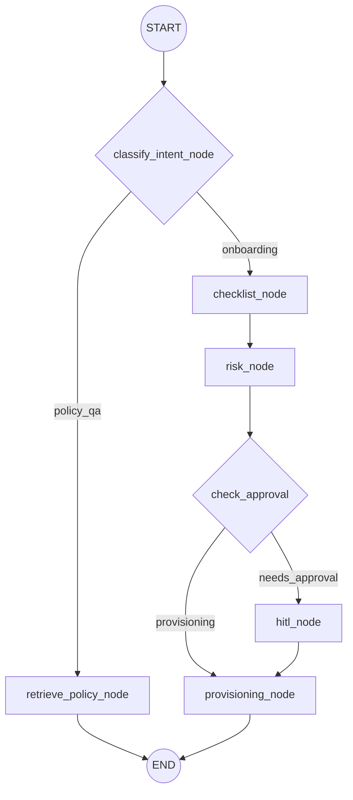

# HR Policy & Onboarding Agent

An intelligent, agentic HR Assistant built with LangGraph, LangChain, and FastAPI. This project automates employee onboarding (provisioning accounts, generating checklists) and handles HR policy Q&A using RAG. It features robust guardrails for PII redaction and RBAC compliance.

## Features

- **Agentic Workflow:** Utilizes LangGraph to build a state machine that handles request routing, policy retrieval, risk calculation, and account provisioning.
- **Automated Provisioning:** Mocks API calls to provision user accounts across various systems (e.g., Slack, Email, GitHub) with strict idempotency and retry logic.
- **RAG Policy Engine:** Automatically scans local Markdown HR policies to answer compliance and benefit questions using LlamaIndex.
- **FastAPI Backend:** Exposes simple REST endpoints to process individual onboarding requests or batch-process historical data.
- **Security & Guardrails:** Evaluates a risk score based on the role and requested systems, escalating to a Human-in-the-Loop (HITL) step if the threshold is exceeded. It also redacts PII like emails and SSNs.
- **Observability:** Pre-configured with OpenTelemetry tracing and LangSmith to monitor agent decisions and audit trails.
- **Streamlit UI:** A clean frontend interface to process tickets and view JSON outcomes visually.
- **Dockerized:** Fully containerized for easy deployment and isolation via Docker Compose.

---

## Agent Architecture



---

## Prerequisites

- Python 3.11+
- Docker & Docker Compose
- An OpenAI API Key (`OPENAI_API_KEY`)

---

## Local Setup

1. **Clone and setup a virtual environment:**
   ```bash
   python -m venv venv
   source venv/bin/activate  # On Windows use `venv\Scripts\activate`
   ```

2. **Install dependencies:**
   ```bash
   pip install -r requirements.txt
   ```

3. **Configure Environment Variables:**
   Create a `.env` file in the root directory:
   ```env
   OPENAI_API_KEY=your-openai-key-here
   # Optional: LANGSMITH_API_KEY=your-langsmith-key
   # Optional: LANGSMITH_TRACING=true
   ```

4. **Run the FastAPI Server locally:**
   ```bash
   uvicorn main:app --reload --port 8000
   ```

---

## Docker Compose Setup (Recommended)

This project uses Docker Compose to run both the FastAPI backend and the Streamlit UI simultaneously.

1. **Build and start the stack:**
   ```bash
   docker compose up -d --build
   ```

2. **Access the Streamlit UI:**
   Open your browser and navigate to: [http://localhost:8502](http://localhost:8502)

3. **Access the Backend API Docs:**
   Open your browser and navigate to: [http://localhost:8001/docs](http://localhost:8001/docs)

4. **Stop the stack:**
   ```bash
   docker compose down
   ```

---

## Testing

The project uses `pytest` for unit testing the graph execution, risk scoring, RBAC validation, and PII redaction. 
To run the tests:
```bash
PYTHONPATH=. pytest tests/
```
