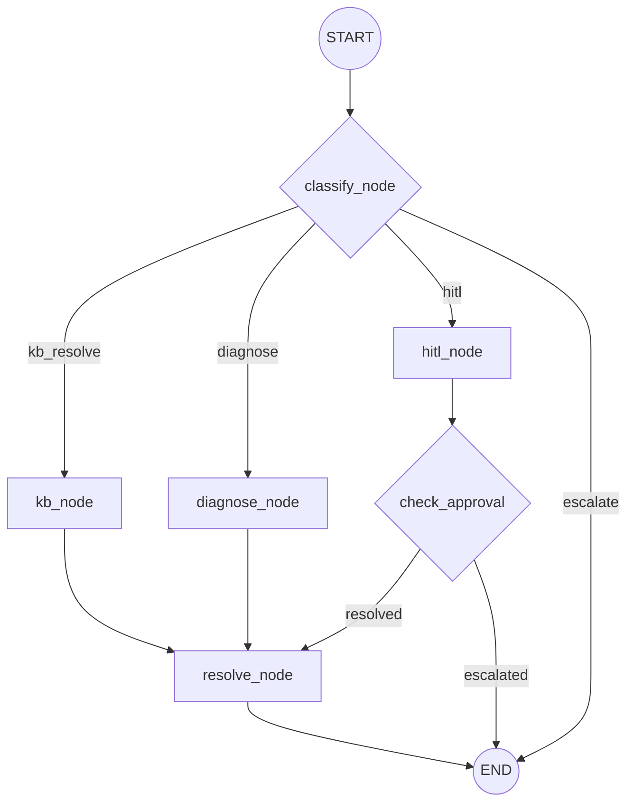

# IT Helpdesk Resolution Agent

An intelligent, agentic IT Helpdesk system built with LangGraph, LangChain, and FastAPI. This project automates the triage, diagnosis, and resolution of IT support tickets using LLMs to extract context from internal Knowledge Base (KB) articles and generate clear resolution steps.

## Features

- **Agentic Workflow:** Utilizes LangGraph to build a state machine that handles routing, knowledge retrieval, diagnostics, and human-in-the-loop (HITL) escalations.
- **Automated Routing:** A hybrid deterministic and LLM-based router classifies incoming tickets (e.g., Network, Software, Hardware) and directs them to the appropriate resolution path.
- **Knowledge Base Integration:** Automatically scans local Markdown KB articles to find step-by-step solutions for common issues (WiFi failures, Printer Jams, Excel licensing).
- **FastAPI Backend:** Exposes simple REST endpoints to process individual tickets or batch-process historical data.
- **Security & Guardrails:** Validates incoming ticket descriptions to block prompt injection attacks and PII leaks before LLM processing.
- **Observability:** Pre-configured with OpenTelemetry and LangSmith tracing to monitor agent decisions and LLM execution costs.
- **Dockerized:** Fully containerized for easy deployment and isolation.

---

## Agent Architecture



---

## Project Structure

- `main.py`: The FastAPI application entry point, exposing the REST API endpoints.
- `graph.py`: Defines the LangGraph state machine, nodes, and conditional edges.
- `router.py`: Contains the routing logic to classify tickets and determine the execution path (`kb_resolve`, `diagnose`, `escalate`, `hitl`).
- `tools.py`: LangChain tools for interacting with the environment (e.g., searching KB articles, running mock diagnostic commands).
- `models.py`: Defines the strictly typed `AgentState` using Pydantic.
- `guardrails.py`: Input validation logic to prevent prompt injections.
- `data_loader.py`: Utility for loading and validating batch JSON tickets.
- `observability.py`: Wraps the agent execution with OpenTelemetry traces and LangSmith logging.
- `config.py`: Centralized environment and application configuration via Pydantic Settings.
- `data/`: Contains mock incident tickets (`it_tickets.json`) and Markdown Knowledge Base articles (`kb_articles/`).

---

## Prerequisites

- Python 3.11+
- Docker (optional, for containerized execution)
- An OpenAI API Key (`OPENAI_API_KEY`)

## Local Setup

1. **Clone and setup a virtual environment:**
   ```bash
   python -m venv venv
   source venv/bin/activate  # On Windows use `venv\Scripts\activate`
   ```

2. **Install dependencies:**
   ```bash
   pip install -r requirements.txt
   ```

3. **Configure Environment Variables:**
   Create a `.env` file in the root directory based on the provided `.env example`:
   ```env
   OPENAI_API_KEY=your-openai-key-here
   # Optional: LANGSMITH_API_KEY=your-langsmith-key
   # Optional: LANGSMITH_TRACING=true
   ```

4. **Run the FastAPI Server locally:**
   ```bash
   uvicorn main:app --reload --port 8000
   ```

---

## Docker Setup

You can run the application fully containerized. A volume mount is recommended during development so the container instantly sees new KB articles.

1. **Build the image:**
   ```bash
   docker build -t it-helpdesk-agent .
   ```

2. **Run the container:**
   ```bash
   # Note: Port 8080 is mapped to the internal 8000 port
   docker run -d --rm \
     -p 8080:8000 \
     -v "$(pwd):/app" \
     --env-file .env \
     --name helpdesk-agent \
     it-helpdesk-agent
   ```

---

## API Endpoints

### 1. Health Check
```bash
curl http://localhost:8080/health
```

### 2. Process a Single Ticket
Processes a single IT ticket and returns the resolved state.

**Request:**
```bash
curl -X 'POST' \
  'http://localhost:8080/process_ticket' \
  -H 'Content-Type: application/json' \
  -d '{
  "ticket_id": "INC-2048",
  "description": "Cannot connect to office WiFi. Device shows Authentication Failed. Tried rebooting."
}'
```

### 3. Batch Process Tickets
Processes an array of mock tickets directly from the `data/it_tickets.json` file. Useful for testing all scenarios at once.

**Request:**
```bash
curl -X 'POST' http://localhost:8080/tickets/batch
```

---

## Testing

The project uses `pytest` for unit testing the graph execution and data loaders. 
To run the tests:
```bash
PYTHONPATH=. pytest tests/
```
